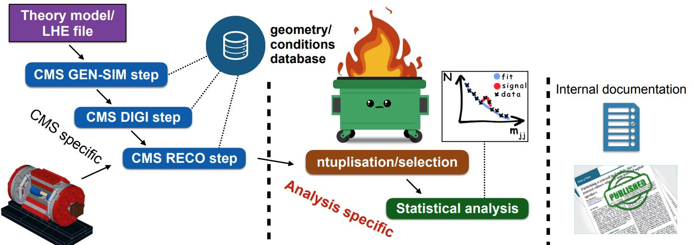
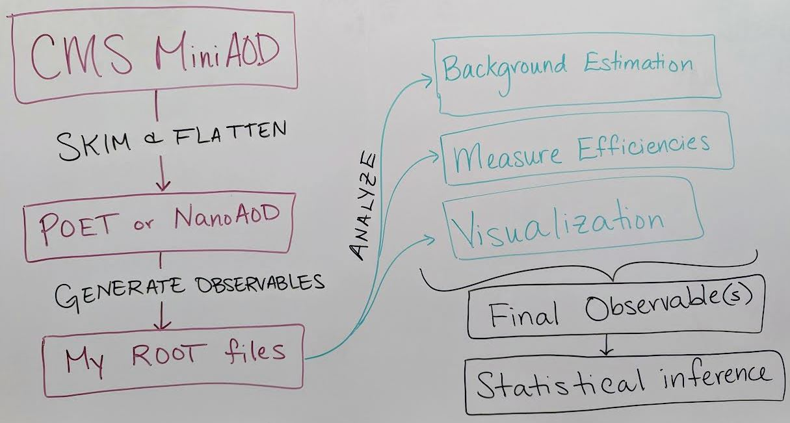
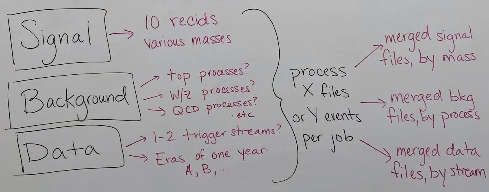

In the [Simplified Run 2 analysis lesson](https://cms-opendata-workshop.github.io/workshopwhepp-lesson-ttbarljetsanalysis/) you learned tools to take POET ROOT files and apply event and/or physics object selections to form an analysis. This is a key element of forming a search or measurement using CMS Open Data. How does it fit into the whole picture?

The image above shows where a user's analysis falls in the grand scheme of CMS. The Open Data provides you with everything in the left column: all of the official CMS processing of the raw data has been done to produce AOD or MiniAOD ROOT files published on the Open Data Portal. The software behind these files is accessible to anyone who wishes to take a deep dive! From your own work, you are likely very familiar with the process described in the right column: documenting and publishing an analysis. What you have learned in this workshop is how to perform some of the steps required for the central, analysis specific, column.

> ## We can't tell you what to do!
> As you might expect, the workflow of any analysis is, by definition, ``analysis specific"!
> This episode is intended to give you a flavor of a workflow, it's not exhaustive.
{: .callout}

## An analysis workflow

There are as many unique analysis workflows as there are physicists! But here is one outline:

- **Skimming and flattening**: you've seen how the POET software can perform this step in the [Physics Objects lesson](https://cms-opendata-workshop.github.io/workshopwhepp-lesson-physics-objects/). To analyze Open Data from 2011 -- 2015 this will always be the first step! In the future, CMS will also release `NanoAOD` files that are similar in structure to POET files so many users will not need to perform a ``flattening" step.

- **Generate observables**: if POET or NanoAOD files are available, the next (or potentially first) analysis step is to use the physics object data in those ROOT files to generate observables of interest for a certain analysis.
  - In the example top quark analysis, [this step](https://cms-opendata-workshop.github.io/workshopwhepp-lesson-ttbarljetsanalysis/04-fullanalysis/index.html) applied the event selection and computed the invariant mass of the hadronic top quark.
  - Most CMS analysts compute **many** observables related to both signal and background event topologies, and might incorporate machine learning methods for additional event selection information and/or interesting observables.
  - This analysis step can be done in C++ or python using software like ROOT and uproot that can interpret the input TTree objects. 

- **Analyze!** This is the point at which analysis workflows become very unique based on the user's needs. You might:
  - Determine how to model background processes. If background will be modeled from data, separate selection regions are typically defined and fitted functions or transfer factors are computed to provide an estimate of background in a signal-enriched region.
  - Measure efficiencies of various selection criteria to determine transfer factors and/or systematic uncertainties.
  - Visualize your data by creating histograms or other plots, usually incorporating multiple data and simulation sources representing both signal and background.
  - Train a machine learning technique to discriminate signal from background
  - and many other possible tasks!

- **Final observables**: at this point you might need to loop back to "Generating observables" and add new variables to your analysis based on what you have learned from initial analysis of your data. Eventually, CMS analysts arrive at a set of final observables:
  - Counting experiment: the simplest observable is the number of events passing a set of selection criteria. Event counts for signal and background processes, along with their uncertainties, can be extracted from histograms or functional forms.
  - Histograms: signal and background distributions for an observable of interest can be stored as histograms so that event counts in multiple bins of a distribution can be used for statistical inference.
  - Functional forms: in some analyses, the shape of the signal and/or background processes for the observable of interest might be described using functional forms.

- **Statistical inference**: the final step of most CMS analyses is to determine the rate of predicted signal that is consistent with the data, by fitting **Data = BackgroundPrediction + Rate*SignalPrediction**. The [CMS ``Higgs Combine" software](https://cms-analysis.github.io/HiggsAnalysis-CombinedLimit/) is publically accessible for performing such fits, and the [bonus material for the example analysis](https://cms-opendata-workshop.github.io/workshopwhepp-lesson-ttbarljetsanalysis/05-systematics-stats/index.html#introduction-to-stats-analysis) shares a python-based option for performing statistical analysis

## Incorporating distributed processing

Theoretically, any of the preceeding analysis elements can be done using distributed computing! But the early steps of processing AOD or MiniAOD files and generating observables stored in your preferred data formats benefit the most from parallelization. In many cases it would not be computationally feasible to analyze all the MiniAOD required for a typical analysis on one personal computer. 

Previous CMS Open Data Workshops have presented an example workflow for parallelization that:
- Produces a POET file from AOD or MiniAOD
- Merges the POET files from many parallel jobs
- Produces an example plot from the merged file

With modern columnar analysis tools, it has become reasonably fast and accessible to perform later analysis steps on POET or NanoAOD files on a local machine, as you can see in the top quark analysis example. 

## Preparing and executing analysis jobs

After identifying or developing the processing you would like to perform on CMS Open Data files, such as running POET on MiniAOD files, the first task is to determine which datasets will be included. 

This image shows a list of records that might be used to search for a certain BSM signal, using simulation to model background. The simulated processes for signal and background need to be identified on the Portal as well as the collision data to which the simulation will be compared (review the [dataset scouting lesson](https://cms-opendata-workshop.github.io/workshopwhepp-lesson-dataset-scouting/)!). A simulation-driven analysis can easily build up 30 - 50 Open Data records to be processed, especially if systematic uncertainty variation samples exist for some background processes.

Testing your software on your personal machine is a good way to determine how much time is required to analyze a certain number of MiniAOD files, or a certain number of events. The distributed computing tools we will show you allow either type of division for your jobs. 

Finally, the results of the parallel processing for each unique process can be merged such that the final result is a small number of data files representing each individual signal, background, and data process. 

> ## Google Cloud processing
> The 2023 CMS Open Data Workshop featured a [lesson on using Google Cloud services](https://cms-opendata-workshop.github.io/workshop2023-lesson-cloud/) to perform Open Data
> analysis at scale. After any available free trial is used, this method incurs costs based on your usage.
{: .callout}

> ## HTCondor processing
> Many researchers affiliated with universities or laboratories may have access to Linux computing clusters. 
> As you saw in the pre-exercise, **this workshop will use the TIFR cluster** to submit analysis jobs. 
{: .callout}



